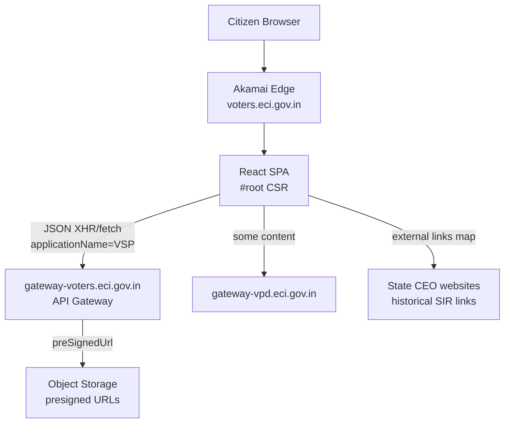

# Website Architecture Report

## Summary

`https://voters.eci.gov.in/download-eroll` is a **client-side rendered React SPA** (Citizen Service Portal)
fronted by **Akamai**. Business data is fetched from `https://gateway-voters.eci.gov.in`.

## High-level diagram



## Stack signals

| Layer | Finding |
|-------|---------|
| UI | React + React Router routes (`/download-eroll`, `/download-final-roll`, `/download-sir-draft-roll`, …) |
| State/data | Redux Toolkit Query services (`contentLoaderServiceApi`, common services) |
| Bundling | CRA/Webpack hashed `/static/js/main.*.js` + many lazy chunks (`asset-manifest.json`) |
| Legacy | `/angular/*.js` script tags still loaded in shell HTML |
| CSS | Bootstrap + custom hashed CSS |
| Transliteration | jQuery + CDAC typing packages |
| RUM | Akamai mPulse Boomerang |

## Static vs dynamic

- **Static**: HTML shell, `/static/**`, `/Packages/**`, `/angular/**`, `asset-manifest.json`
- **Dynamic**: All eroll selectors and PDF links — JSON APIs after hydration
- **SSR/CSR**: CSR only (`noscript` message; empty `#root`)
- **Service Worker**: paths like `/service-worker.js` return SPA HTML fallback — **no real SW**

## CSP connect-src (allowed API hosts)

- https://voters.eci.gov.in
- https://gateway-voters.eci.gov.in
- https://gateway-vpd.eci.gov.in
- https://affidavit.eci.gov.in
- https://eos-s2.eci.gov.in:15443
- https://gateway-s2-blo.eci.gov.in
- https://gateway-s1-blo.eci.gov.in
- https://eos-s1.eci.gov.in:15443
- https://gateway-s3-blo.eci.gov.in
- https://cdn.jsdelivr.net
- https://cb.eci.gov.in:5005

## Hierarchy (verified)

```
Country (IN)
  └─ State/UT (stateCd e.g. S24, U05)
       └─ District (districtNo / districtCd e.g. S2408)
            └─ Assembly Constituency (asmblyNo / acNumber)
                 └─ Year + Roll/Revision type (signed API)
                      └─ Language (get-ac-languages)
                           └─ Part
                                └─ PDF (presigned object-store URL)
```

**Not** on the primary download cascade: Parliamentary Constituency.
**Section** appears in SIR *search* UIs, not as a required PDF download level.
