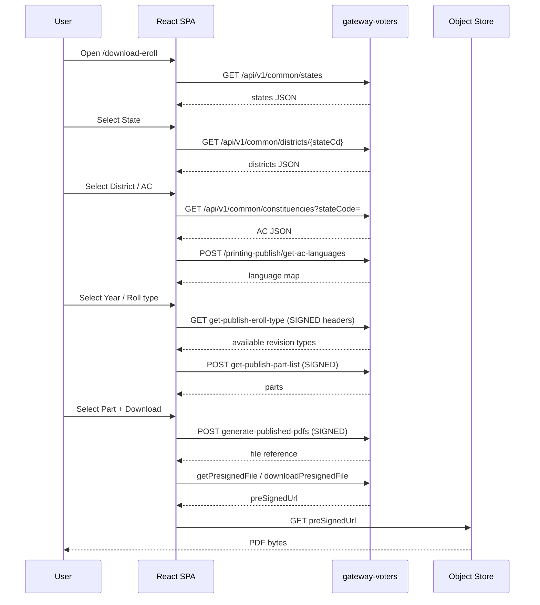

# Download Flow Documentation

## User-visible cascade on `/download-eroll`

1. Load CSR SPA at /download-eroll (Akamai → React #root hydrates)
2. Initial form fields visible: State*, Year Of Revision* (2026/2025/2024), Captcha*, Download Selected PDFs
3. Anonymous GET /api/v1/captcha-service/getCaptcha/EROLL (captcha image/data for download page)
4. GET /api/v1/common/states populates State dropdown
5. User selects State → subsequent District / AC / roll-type / language / part selectors load dynamically
6. GET /api/v1/common/districts/{stateCd} and GET /api/v1/common/constituencies?stateCode=
7. POST /api/v1/printing-publish/get-ac-languages {stateCd, acNumber}
8. SIGNED GET get-publish-eroll-type (accept_yek / accept_rotcev) for revision types
9. SIGNED POST get-publish-part-list → Part checkboxes/list
10. User solves Captcha (human) + selects parts → SIGNED POST generate-published-pdfs
11. Resolve object-store file via document-adhoc presigned URL APIs
12. Browser downloads PDF from temporary preSignedUrl

## Sequence (logical)

## PDF URL characteristics

| Property | Observation |
|----------|-------------|
| Predictable permanent URL? | **No** — goes through generate + object store |
| Presigned / temporary? | **Yes** (`preSignedUrl`) |
| Session / token linked? | Likely; signing headers + optional bearer on some document APIs |
| One-time? | Treat as short-lived; do not assume permanence |
| Mass enumerable? | **No** without signing + valid part metadata |

## Related routes

- `/download-eroll` — general published rolls
- `/download-final-roll` — SIR final roll UI
- `/download-sir-draft-roll` — SIR draft roll UI
- `/download-statutory-report` — statutory reports
- `/bh_2003_eroll` — Bihar 2003 historical
- External CEO links for older intensive revisions (per-state map in SPA)
