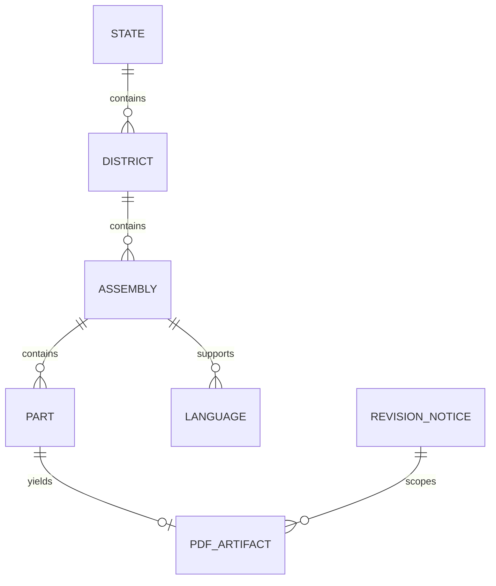

# Future Compliant Crawler — Software Design

## Principles

1. Prefer **official bulk channels** if/when ECI provides them.
2. Use **public geo APIs** for indexing only.
3. **Do not** reverse request-signing or CAPTCHA solvers.
4. Human-in-the-loop for any gated PDF retrieval.
5. Strict rate limits, audit logs, and legal review.

## Phased plan

- Phase 1: nightly geo inventory via public APIs (this project)
- Phase 2: detect revision availability only through unsigned signals / official notices
- Phase 3: if authorized, human-in-the-loop browser session for sample/part downloads
- Phase 4: store checksums + metadata; incremental updates by revision year
- Never embed reversed signing keys or CAPTCHA solvers

## Suggested folder structure (future crawler — not this repo's scraper)

```
compliant_crawler/
  config/
  inventory/          # public API sync jobs
  browser_assisted/   # optional headed sessions
  storage/            # metadata DB + object store refs
  pipelines/
  monitoring/
  docs/legal/
```

## Suggested metadata schema

```sql
CREATE TABLE state (
  state_cd TEXT PRIMARY KEY,
  state_name TEXT,
  state_type TEXT,
  is_active TEXT
);

CREATE TABLE district (
  state_cd TEXT,
  district_no TEXT,
  district_cd TEXT,
  district_name TEXT,
  PRIMARY KEY (state_cd, district_no)
);

CREATE TABLE assembly (
  state_cd TEXT,
  asmbly_no INTEGER,
  district_cd TEXT,
  asmbly_name TEXT,
  category TEXT,
  PRIMARY KEY (state_cd, asmbly_no)
);

CREATE TABLE revision_notice (
  state_cd TEXT,
  year TEXT,
  roll_type TEXT,
  source TEXT,
  observed_at TIMESTAMPTZ
);

CREATE TABLE download_job (
  id UUID PRIMARY KEY,
  state_cd TEXT,
  asmbly_no INTEGER,
  part_no TEXT,
  language TEXT,
  status TEXT,
  authorized_by TEXT,
  created_at TIMESTAMPTZ
);
```

## Retry / logging / incremental strategy

| Concern | Recommendation |
|---------|----------------|
| Retry | Exponential backoff on 429/5xx only; never retry CAPTCHA failures with solvers |
| Logging | Structured JSON logs; never log secrets/signing material |
| Incremental | Re-sync geo weekly; track revision notices; download only deltas when authorized |
| Monitoring | Alert on bundle hash change, endpoint 401/403 spike, ToS updates |

## Entity relationship


